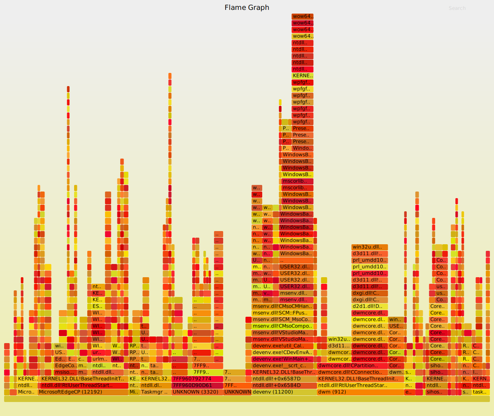

# LiveStacks

This tool records, aggregates, and displays call stacks from interesting ETW events across the system. It resolves .NET symbols by using the CLRMD library to inspect the CLR data structures, which means it does not require CLR rundown events or NGen PDB files to be generated. On the other hand, it works only in live mode, when the collection and analysis happens on the target system. Importantly, if the target process exits before the tool had a chance to print stacks, symbol resolution will fail, so it is more suitable for longer-running processes.

> NOTE: This project is not done. There are still some unimplemented features, and the code hasn't been extensively tested. Caveat emptor, and pull requests welcome!

## Running

Open a command prompt window as administrator, and try some of the following examples.

Collect CPU sampling events system-wide and print the top hottest stacks when Ctrl+C is hit:

```
LiveStacks
```

Collect information for a specific process:

```
LiveStacks -p 7408
```

Trace stacks for triggered garbage collections (when the application calls `GC.Collect()`):

```
LiveStacks -e clr:gc:gc/triggered
```

Trace stacks for file I/O operations:

```
LiveStacks -e kernel:fileioinit
```

Trace stacks for image load (DLL/EXE) events with a custom display interval (-i) and number of top stacks to display (-T):

```
LiveStacks -e kernel:imageload -i 1 -T 5
```

Print stacks in folded format, suitable for direct pass-through to the [FlameGraph.pl](https://github.com/BrendanGregg/FlameGraph) script, and only print once before quitting (-c).

```
LiveStacks -c 1 -f
```

## Example Output

Native process, heavy CPU consumption:

```
10:47:58 AM
        811 [EatCPU 7408]
    EatCPU.exe!DoWork+0x27
    EatCPU.exe!main+0x47
    EatCPU.exe!invoke_main+0x1E
    EatCPU.exe!__scrt_common_main_seh+0x15A
    EatCPU.exe!__scrt_common_main+0xD
    EatCPU.exe!mainCRTStartup+0x8
    KERNEL32.DLL!@BaseThreadInitThunk@12+0x24
    ntdll.dll!__RtlUserThreadStart+0x2F
    ntdll.dll!__RtlUserThreadStart@8+0x1B
         400 [EatCPU 7408]
    EatCPU.exe!DoWork+0x1E
    EatCPU.exe!main+0x47
    EatCPU.exe!invoke_main+0x1E
    EatCPU.exe!__scrt_common_main_seh+0x15A
    EatCPU.exe!__scrt_common_main+0xD
    EatCPU.exe!mainCRTStartup+0x8
    KERNEL32.DLL!@BaseThreadInitThunk@12+0x24
    ntdll.dll!__RtlUserThreadStart+0x2F
    ntdll.dll!__RtlUserThreadStart@8+0x1B
```

The numbers on top (811, 400) are the number of samples captured with this call stack. Then the process name and process ID are displayed, followed by the actual call stack.

Visual Studio process:

```
         28 [devenv 4196]
            6DB9F614
            6DB96369
            6DC16EA5
            6DB81CF7
            6DC2BFA1
            6DC1CBB0
        7FF9F0832A11
        7FF9F0868986
        7FF9F0819FAE
    win32u.dll!NtUserCallOneParam+0xC
    USER32.dll!GetKeyboardLayout+0x1C
    WindowsBase.ni.dll!DomainNeutralILStubClass.IL_STUB_PInvoke(Int32)+0x34
    PresentationCore.ni.dll!System.Windows.Input.InputMethod.IsImm32ImeCurrent()+0x25
    PresentationCore.ni.dll!System.Windows.Input.TextServicesManager.PostProcessInput(System.Object, System.Windows.Input.ProcessInputEventArgs)+0x1F
    PresentationCore.ni.dll!System.Windows.Input.InputManager.RaiseProcessInputEventHandlers(System.Windows.Input.ProcessInputEventHandler, System.Windows.Input.ProcessInputEventArgs)+0x9A
    PresentationCore.ni.dll!System.Windows.Input.InputManager.ProcessStagingArea()+0x23F
    PresentationCore.ni.dll!System.Windows.Input.InputManager.ProcessInput(System.Windows.Input.InputEventArgs)+0x45
    PresentationCore.ni.dll!System.Windows.Input.InputProviderSite.ReportInput(System.Windows.Input.InputReport)+0x62
    PresentationCore.ni.dll!System.Windows.Interop.HwndMouseInputProvider.ReportInput(IntPtr, System.Windows.Input.InputMode, Int32, System.Windows.Input.RawMouseActions, Int32, Int32, Int32)+0x2D8
    PresentationCore.ni.dll!System.Windows.Interop.HwndMouseInputProvider.FilterMessage(IntPtr, MS.Internal.Interop.WindowMessage, IntPtr, IntPtr, Boolean ByRef)+0x1FD
    PresentationCore.ni.dll!System.Windows.Interop.HwndSource.InputFilterMessage(IntPtr, Int32, IntPtr, IntPtr, Boolean ByRef)+0x6C
    WindowsBase.ni.dll!MS.Win32.HwndWrapper.WndProc(IntPtr, Int32, IntPtr, IntPtr, Boolean ByRef)+0x9B
    WindowsBase.ni.dll!MS.Win32.HwndSubclass.DispatcherCallbackOperation(System.Object)+0x6B
    WindowsBase.ni.dll!System.Windows.Threading.ExceptionWrapper.InternalRealCall(System.Delegate, System.Object, Int32)+0x4E
    WindowsBase.ni.dll!System.Windows.Threading.ExceptionWrapper.TryCatchWhen(System.Object, System.Delegate, System.Object, Int32, System.Delegate)+0x34
    WindowsBase.ni.dll!System.Windows.Threading.Dispatcher.LegacyInvokeImpl(System.Windows.Threading.DispatcherPriority, System.TimeSpan, System.Delegate, System.Object, Int32)+0x10B
    WindowsBase.ni.dll!MS.Win32.HwndSubclass.SubclassWndProc(IntPtr, Int32, IntPtr, IntPtr)+0xEE
             31DD36A
    USER32.dll!_InternalCallWinProc+0x2B
    USER32.dll!UserCallWinProcCheckWow+0x30A
    USER32.dll!DispatchMessageWorker+0x234
    USER32.dll!DispatchMessageW+0x10
    msenv.dll!MainMessageLoop::ProcessMessage+0xC6
    msenv.dll!CMsoCMHandler::EnvironmentMsgLoop+0xDE
    msenv.dll!CMsoCMHandler::FPushMessageLoop+0x105
    msenv.dll!SCM::FPushMessageLoop+0xB9
    msenv.dll!SCM_MsoCompMgr::FPushMessageLoop+0x2A
    msenv.dll!CMsoComponent::PushMsgLoop+0x2E
    msenv.dll!VStudioMainLogged+0x5BD
    msenv.dll!VStudioMain+0x7C
    devenv.exe!util_CallVsMain+0xDE
    devenv.exe!CDevEnvAppId::Run+0xBA4
    devenv.exe!WinMain+0xBD
    devenv.exe!__scrt_common_main_seh+0xFD
    KERNEL32.DLL!BaseThreadInitThunk+0x24
    ntdll.dll!__RtlUserThreadStart+0x2F
    ntdll.dll!_RtlUserThreadStart+0x1B
```

## Generating Flame Graphs

To generate a flame graph on Windows, you will need to [install Perl](https://www.perl.org/get.html) (I had a good experience with Strawberry Perl). On all platforms, you will need to download the [FlameGraph.pl](https://github.com/BrendanGregg/FlameGraph) script. Then, run LiveStacks in folded mode and pass the stacks through to FlameGraph.pl. In the following example, we sample system activity for 10 seconds, and then print output in folded format, which is later passed to the flame graph generator.

```
LiveStacks -c 1 -i 10 -f > folded.stacks
perl FlameGraph.pl folded.stacks > sampled.svg
```

Here is what a sample flame graph might look like:



## Requirements/Limitations

Creating arbitrary kernel ETW sessions requires Windows 8 or later, and administrative privileges.

To resolve managed symbols, the target process must currently have the same bitness as the tool. If this condition isn't met, managed symbols are not resolved but native symbols will still work properly. This can be addressed in the future by moving the managed symbol resolution into a separate helper process.

Kernel symbols are currently not resolved, and filtered out by default.

## Building

To build the tool, you will need Visual Studio 2015/2017, and the Windows SDK installed (for the symsrv.dll and dbghelp.dll files).
